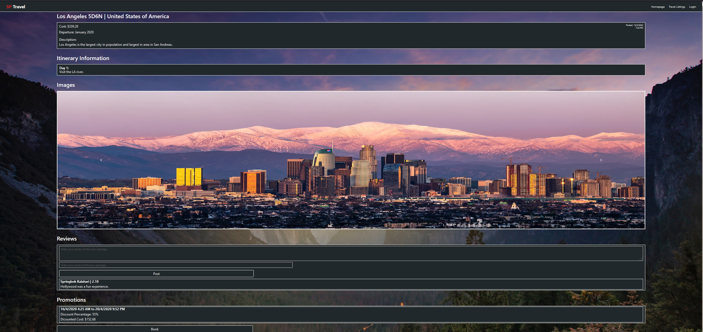
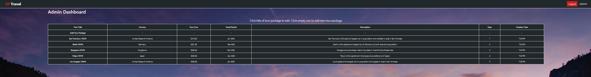
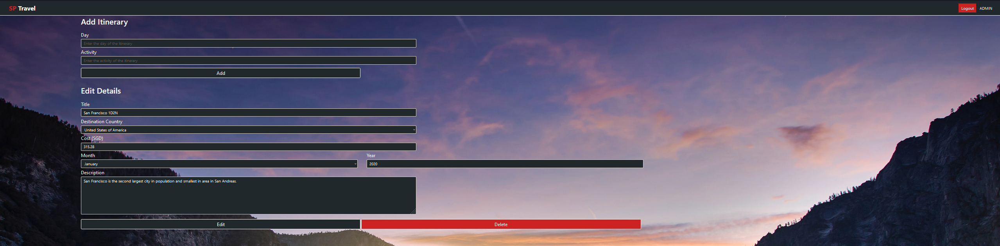

# SP Travels
* An assignment to build a fullstack web application using Express, MySQL and Bootstrap.
* Travel listings website that has a login feature.  
* Frontend design was referenced from a bootstrap template.

## Features
* Search travel listings

* View travel listing and itinerary info
* Add / View travel listing reviews
* Upload images to the travel listings
* Promotions can dynamically affect pricing of travel listings

* Add / Delete / Modify travel listings and itineraries as administrator

* Persistent login using JWT tokens
* Asynchronous programming

## Setup

### Steps

* **current_directory** is the full directory path of the folder in which this file is in.

1.  Download MySQL installer and MySQL Workbench setup wizard.

2.  Install a MySQL database server and the MySQL Workbench.

3.  Launch MySQL Workbench, 
    then connect to the MySQL database server by clicking on the instance in the main menu, and entering your credentials.
    
4.  Click on "File" in the top-left hand corner, then the "Run SQL Script..." option in the sub-menu. 
    Navigate to "**current_directory**/Back_End/Database_Creation".
    Select "sp_travel_init.sql" and run it to create the database needed to hold the data.
    
5.  Repeat step 04 with "sp_travel_seed.sql" to fill the database with sample data.

6.  Repeat step 04 with "sp_travel_show.sql" to view the sample data in the database.

7.  Download NodeJS installer.

8.  Install NodeJS.

9.  Ensure the NodeJS directory installed by the installer is added to the System Environment Variable PATH.

10. Fill in the information required (host, user, password) to log into the MySQL server setup earlier, in "**current_directory**/Back_End/Others/information.json".

11. Start the Back-End HTTP server by running "cd **current_directory**/Back_End/SP_Travel_API", then "npm run start-dev" in the terminal.

12. The API can now be tested by sending HTTP requests to the server "http://localhost:3000/", through a program like Postman.

13. Start the Front-End HTTP server by running "cd **current_directory**/Front_End", then "npm run start-dev" in the terminal.

14. The website can now be accessed by going to "http://localhost:3001/" on a web browser.

### Additional Notes

1. Any assumptions made have been placed at the top of the files in these folders.

2.  "**current_directory**/Back_End/Others/testData.json" contains information that can be used to test out the API.

3.  Passwords of users:
    * "Admin": "admin"
    * "Atlas Earthquake": "earthquake"
    * "Springbok Kalahari": "kalahari"
    * "Italia Cirrus": "cirrus"
    * "Wombat Beachmaster": "beachmaster"
